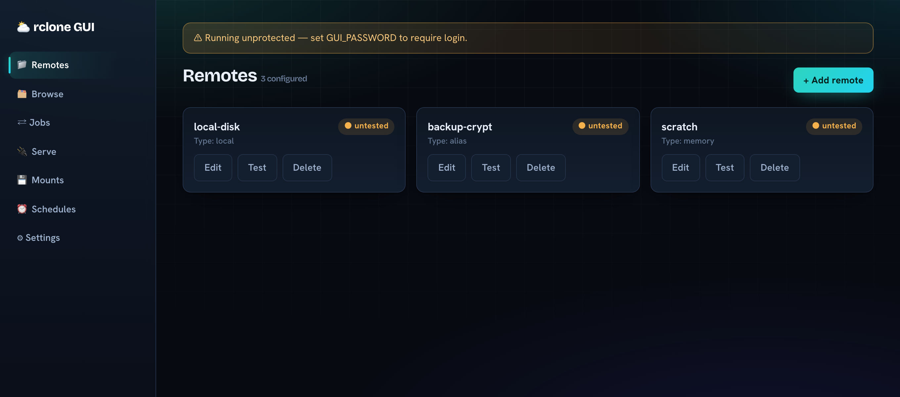

# rclone GUI

A self-hostable web GUI for [rclone](https://rclone.org) — configure remotes, browse
files, run transfers, expose/mount remotes, and schedule jobs, all from one Docker
container. Every backend option is rendered as a form field carrying rclone's own help
text as a tooltip and its default value, so you never have to memorize flags.



## Features

- **Remotes & configuration** — create / edit / delete / test remotes across all 70+
  rclone backends via auto-generated forms (every option, with tooltip + default;
  advanced options collapsed; passwords masked; OAuth backends supported).
- **Browse & operations** — navigate a remote's files, create folders, delete, and
  copy/move to any remote with **live job progress** and stop.
- **Serve** — expose a remote over HTTP / WebDAV / SFTP / FTP / DLNA / NFS / S3 / restic
  (start / list / stop).
- **Mounts** — mount a remote as a local filesystem (mount / list / unmount).
- **Scheduling** — saved copy/move jobs on a cron schedule, with run history and
  "run now".
- **Bandwidth limit** — set a global transfer rate live from Settings.
- **Ops** — optional password login; bundled rclone with an in-app, checksum-verified
  self-updater.

## Run with Docker

```bash
docker compose up -d --build
# or:
docker build -t rclone-gui .
docker run -d -p 3000:3000 -v "$PWD/config:/config" -e GUI_PASSWORD=changeme rclone-gui
```

Open <http://localhost:3000>. rclone's config is persisted at `/config/rclone.conf`,
and self-updated rclone binaries at `/config/bin/rclone`.

- Set `GUI_PASSWORD` to require login. Omit it to run unprotected (a warning banner is shown).
- **Settings** shows the installed rclone version and can update it.
- **Mounts** require FUSE: add `--cap-add SYS_ADMIN --device /dev/fuse` (and a
  bind-mounted target with shared propagation) to the container, or mount calls will
  fail. Serve and everything else need no extra privileges.

### Unraid / Portainer
Use the image with a single volume mapped to `/config` and port `3000` published; set
`GUI_PASSWORD` as an environment variable.

## Develop

npm workspaces monorepo (`server` = Fastify API supervising a child `rclone rcd`;
`web` = React + Vite SPA). Node 20+.

```bash
npm install
npm run fetch-rclone                 # download pinned rclone into ./.rclone (for the backend)
RCLONE_BINARY="$PWD/.rclone/rclone" RCLONE_GUI_CONFIG_DIR="$PWD/.devconfig" \
  npm --workspace server run dev     # backend on :3000
npm --workspace web run dev          # SPA on Vite's port, proxying /api -> :3000
npm --workspace server run test      # backend tests (real rclone rcd, local backend)
npm --workspace web run test         # frontend tests (mocked API)
```

Architecture and conventions are documented in [`CLAUDE.md`](./CLAUDE.md); design specs
and implementation plans live under [`docs/superpowers/`](./docs/superpowers/).

## Roadmap / future enhancements

The core product is complete. Ideas below are not yet built — contributions and
prioritization welcome.

### Transfers & jobs
- **Pause / resume transfers** (per job, or globally) — note: rclone has no native
  per-job pause, so this likely means stop + resume-from-checkpoint, or a global pause
  via a temporary `--bwlimit 0`/`off` toggle.
- **Sync** (mirror with deletes) and **bisync** (two-way), with a **dry-run** preview
  before committing.
- **Filters** — include/exclude patterns, min/max age and size for a transfer.
- **Transfer tuning** — expose `--transfers`, `--checkers`, `--tpslimit`, retries per job.
- **Bulk operations** — multi-select in the browser for delete/copy/move.
- **Per-job log viewer** and a downloadable log.
- **WebSocket push** for live progress (replace the current 1.5 s polling).

### Browsing & files
- **Upload from the browser** (drag-and-drop local files into a remote).
- **Download / preview** a file; basic image/text preview.
- **Search** within a remote; **rename** in place.
- **Remote usage / quota** (`operations/about`) shown on the dashboard.

### Automation
- **Missed-run backfill** — run schedules that were due while the container was down.
- **Per-schedule timezone**; **overlap guard** (skip if the previous run is still going).
- **Persisted bandwidth limit** re-applied on startup; **scheduled bandwidth** (time-of-day tiers).
- **Connection health monitoring** — periodic remote tests with status history.

### Notifications & observability
- **Failure notifications** via webhook / ntfy / Discord / Slack / email (e.g. on a
  failed schedule or job).
- **Metrics** — a Prometheus `/metrics` endpoint; an activity dashboard.
- **Audit log** of GUI actions.

### Security & multi-tenancy
- **Multi-user auth** with roles/permissions (replacing the single shared password).
- **HTTPS/TLS** termination option and a `secure` session cookie when served over TLS.
- **Per-remote access controls.**

### UX & deployment
- **Theming / dark mode** and a mobile-responsive layout; general visual polish.
- **Config import/export** and backup of `rclone.conf`.
- **i18n / localization.**
- **Published multi-arch image** (amd64/arm64) and an Unraid Community Apps template.
